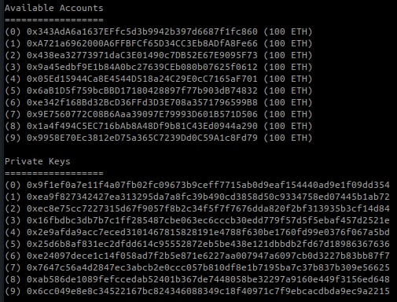

# Deploy your dApp with KATENA
In order to start deploying your own dApps using KATENA, we strongly recommend looking at the files in [Examples](./examples/) and [Benchmark](./benchmark/) folders. 
KATENA can be used with our [Docker](https://www.docker.com/) image or directly on your OS.

### Docker setup
If you want to deploy your applications on Ganache, you will need two terminals active at the same time: one for running Ganache and another one for KATENA.

The required steps are the following for the first terminal:
- `docker build -t katena .`: build the docker image
- `docker run -it katena`: run the container.
- `npx ganache-cli -l 10000000 -g 1 --allowUnlimitedContractSize`: create a [ganache](https://trufflesuite.com/ganache/) instance, that will be our locally hosted Blockchain. Ganache will prompt a set of accounts and private keys to use in the next steps. Alternatively, you can use the `--account_keys_path accounts.json` to print that information in the file `accounts.json` (you can find them at the end of the file looking for `private_keys` key). See [benchmarks](README.md#benchmark-applications) section in the README to understand why we choose those parameters.

Keep Ganache running and open a new terminal inside the container:
- Retrieve the `<container_id>` with `docker ps`.
- `docker exec -it <container_id> /bin/bash` start the new terminal inside the container. 
- Create `input.yml` file to store your wallet credentials. Ganache will prompt that information as shown in the [figure](images/ganache-accounts.jpg) below (or in the `accounts.json` if you used the flag described above). Choose one of the `Available accounts` and its `Private Key`, in `input.yml` create the keys `UserWallet` and `UserKeyGanache`, and paste the two values respectively. Example:
```
UserWallet: '<account>'
UserKeyGanache: '<private_key>'
```
Use [input.example.yaml](./input.example.yaml) as example.



- run the [deploy-bench.sh](deploy-bench.sh) script to automatically deploy the three benchmark applications. In case of errors, the script generates a log stored in the file `deploy.log`. It took 10/20 minutes to complete the entire procedure.
This script automates the following operations (that you should do manually if you are using KATENA to deploy your personal dApp):
    - Move the YAML file containing the application description to the project root (e.g., `cp ./benchmark/ens.yaml .`)
    - The smart contract ABIs of your application must be put in a folder named `contracts` in `nodes` directory. The ABIs of the benchmark applications are in the folders `./nodes/contracts-<APP_NAME>`.
    - Deploy with `xopera` (e.g., `opera deploy -i input.yml ens.yaml`)

### Local setup

**This setting is an alternative to the docker setup. If you are using docker, skip this section**

To use KATENA on your local machine you need:
- We tested our prototype on Ubuntu 20.04.4
- `python 3.8`
- `pip`
- [xopera orchestrator](https://github.com/xlab-si/xopera-opera#installation-and-quickstart): check that the folder `$HOME/.local/bin` is in your $PATH environment variable. pip will install xOpera in this directory
- [Ganache](https://trufflesuite.com/ganache/): this is required to bootstrap a blockchain hosted locally. You can either use this or another Ethereum-compatible client (e.g., [geth](https://geth.ethereum.org/)).


Do the following steps:
- Run a Ganache instance with the command `ganache-cli -l 10000000 -g 1 --allowUnlimitedContractSize` (see [benchmarks](README.md#benchmark-applications) section to understand why we choose those parameters). It will prompt a set of accounts and private keys to use in the next step.
- Create the `input.yml` file that stores your wallet credentials. Ganache will prompt that information as shown in the [figure](images/ganache-accounts.jpg). Choose one of the accounts and its private key, in `input.yml` create the keys `UserWallet` and `UserKeyGanache`, and paste the values respectively. Example:
```
UserWallet: '<account>'
UserKeyGanache: '<private_key>'
```
Use `input.example.yaml` as example. 


- Install the required packages with `pip` (file located [here](requirements.txt)) (`pip install -r requirements.txt`)
- Move the YAML file containing the application description to the project root (e.g., `cp ./benchmark/ens.yaml .`)
- The smart contract ABIs of your application must be put in a folder named `contracts` in `nodes` directory. The ABIs of the benchmark applications are in the folders `./nodes/contracts-<APP_NAME>`. In order to use them copy the ABIs in the contracts folder (`cp -r ./nodes/contracts-ens ./nodes/contracts`)
- Deploy with `xopera` (i.e. `opera deploy -i input.yml ens.yaml`) 
